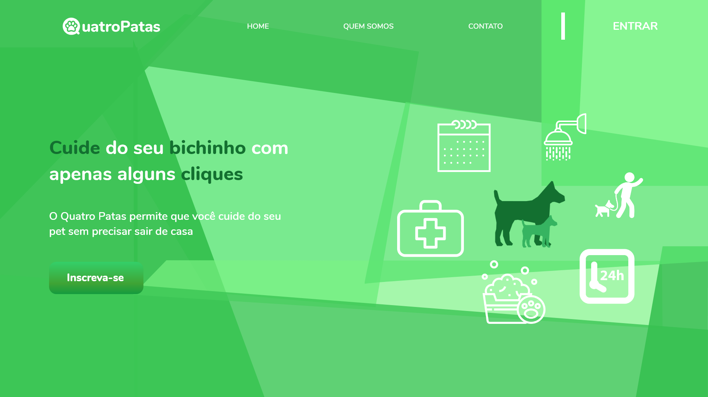
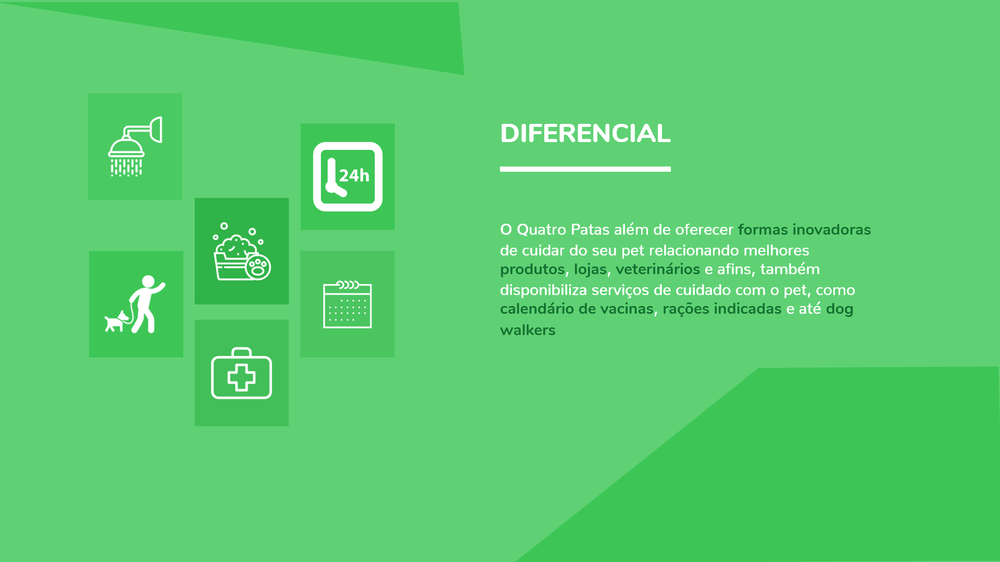

# **Landing Page - Quatro Patas**
</br>

### Para Rodar o Projeto:

    - Instalar npm 
    - Clonar o repositório
    - Instalar as dependências

    ```
        npm install
    ```
</br>
    - Rodar o Projeto:
    ```
        npm start
    ```
</br>

### Protótipo de Alta Fidelidade: 





